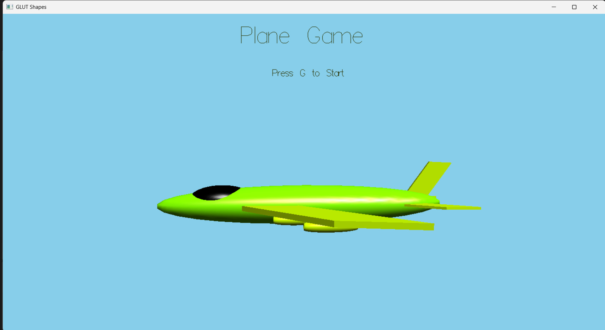
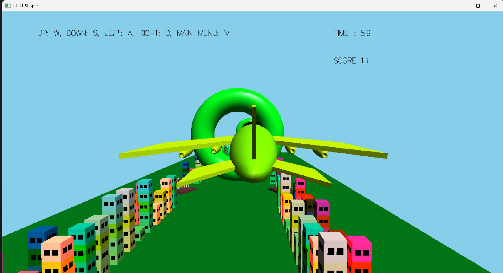

# 3D Plane Game

This is a simple 3D flying game developed using OpenGL and GLUT in C++. The game features a plane navigating through a procedurally generated environment, scoring points by passing through target rings (tori).

## Features

*   3D graphics rendered using OpenGL and GLUT.
*   Simple 3D plane model.
*   Dynamically generated and scrolling environment including ground and buildings (houses).
*   Torus rings serving as scoring targets.
*   Scoring system: earn points by flying through green tori.
*   Score and Time displayed as a 2D overlay in the top-right corner.
*   Basic lighting effects.
*   Start menu and in-game state.
*   Keyboard controls for plane movement and rotation (simulated by environment translation).
*   Includes a basic `RGBpixmap` class for potential texture loading (though not fully utilized for scene textures in the current `main.cpp`).

## Requirements

To build and run this project, you will need:

*   A C++ compiler (like Visual Studio C++).
*   OpenGL development libraries (usually included with graphics drivers or available as SDKs).
*   GLUT (OpenGL Utility Toolkit) library. You will need the header file (`glut.h` or `GL/glut.h`) and the library file (`glut32.lib` or similar) added to your project setup.
*   Windows Operating System (due to the use of `windows.h` and `sprintf_s`).

## How to Play

1.  Launch the game executable. You will see a **menu screen**.
2.  Press the `G` key to **Start the Game**.
3.  Fly the plane using the **keyboard controls** listed below.
4.  Navigate through the **green torus rings** to score points.
5.  Avoid colliding with the **buildings**.
6.  Press the `M` key to return to the **menu**.
7.  Press `Esc` or `Q` to **Exit the game**.

## Controls

*   `W`: Move Environment Up (Plane goes Down) / Roll Plane Left
*   `S`: Move Environment Down (Plane goes Up) / Roll Plane Right
*   `A`: Move Environment Right (Plane goes Left) / Pitch Plane Down & Yaw Plane Left
*   `D`: Move Environment Left (Plane goes Right) / Pitch Plane Up & Yaw Plane Right
*   `G`: Start Game (from menu)
*   `M`: Go to Menu (from game)
*   `R`: Toggle Scene/Menu Plane Rotation
*   `Z`: Zoom In
*   `Shift+Z`: Zoom Out
*   `Esc` or `Q`: Exit Game

## Scoring

Points are scored by successfully guiding the plane's center point through the hole of a **green torus**.

*   Each time you pass through a green torus that has not been scored yet in its current cycle, your `SCORE` increases by 1.
*   Once a torus is scored, it cannot be scored again until the environment chunk it belongs to cycles past the camera and resets.
*   The `TIME` and `SCORE` are displayed in the top-right corner of the screen.
## Building and Running

1.  **Project Setup:**
    *   Create a new C++ project in Visual Studio (e.g., a "Console App" or "Empty Project").
    *   Add `main.cpp` and `RGBpixmap.cpp` to the project's Source Files.
    *   Create a header file `rgbpixmap.h` and add it to the project's Header Files.
    *   Copy the code for `main.cpp`, `RGBpixmap.cpp`, and `rgbpixmap.h` into the respective files in your project directory.
    *   **Crucially, ensure your project is configured to use OpenGL and GLUT.** This typically involves:
        *   Placing `glut.h` (or the `GL` folder containing it) in your project's include path or a system include path.
        *   Placing `glut32.lib` (and `opengl32.lib`, `glu32.lib`) in your project's library path or a system library path.
        *   Configuring the project's Linker settings to include these `.lib` files in "Additional Dependencies". (Often `glut32.lib;opengl32.lib;glu32.lib;` is added).
    *   **Ensure `RGBpixmap.cpp` is included in the build:** Right-click `RGBpixmap.cpp` in Solution Explorer -> Properties -> Configuration Properties -> General -> "Excluded From Build" should be "No".
    *   **Configure Header Paths:** If `rgbpixmap.h` is in a different folder than your `.cpp` files (e.g., a "Headers" subfolder), you need to add the path to that folder in Project Properties -> Configuration Properties -> C/C++ -> General -> "Additional Include Directories".

2.  **Build the Project:**
    *   In Visual Studio, go to `Build` -> `Clean Solution`.
    *   Then go to `Build` -> `Rebuild Solution`.
    *   Resolve any compilation or linking errors based on the messages provided by the compiler. (We worked through common ones like "multiply defined symbols" and "unresolved externals" in the previous conversation, usually related to header/source separation and correct project configuration).

3.  **Run the Game:**
    *   If the build is successful, an executable file (`.exe`) will be created in your project's output directory (e.g., `Debug` or `Release` subfolder).
    *   Run this `.exe` file.

## Code Structure Overview

*   `main.cpp`: Contains the main game loop (`display` function), input handling (`key` function), game state management, drawing logic for the plane and environment chunks (`draw` function), collision detection and scoring logic (within `draw`), and text rendering functions.
*   `RGBpixmap.cpp`: Contains the implementation for the `RGBpixmap` class, which includes functionality to generate checkerboard patterns and read 24-bit uncompressed BMP image files, as well as setting up these images as OpenGL textures.
*   `rgbpixmap.h`: Contains the declarations for the `RGBpixmap` class, its helper types (`mRGB`, `ushort`, `ulong`, `uchar`), and includes necessary OpenGL/GLUT headers. (Note: Constructor and Destructor definitions are placed inline in this header).

---

Enjoy the game!
